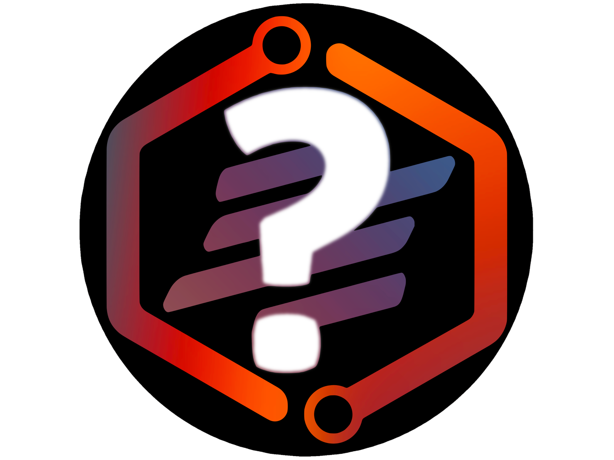

[![Contributors][contributors-shield]][contributors-url]
[![Forks][forks-shield]][forks-url]
[![Stargazers][stars-shield]][stars-url]
[![Issues][issues-shield]][issues-url]
[![MIT License][license-shield]][license-url]

 

  

----

  <h1 align="center">Why Bot</h1>

  

    <h3>An open source, multi-purpose discord bot made to enhance your discord experience :)</h3>
    <a href="https://discord.com/api/oauth2/authorize?client_id=896932646846885898&permissions=8&scope=bot%20applications.commands"><strong>[Add to your server]</strong></a>
     
     
    <a href="https://discord.gg/ryEmgnpKND">Discord Server</a>
    ·
    <a href="https://github.com/FusionSid/Why-Bot/issues">Report Bug</a>
  

 

----

?help - For help

----
 

  
Table of Contents

  <ol>
    <li><a href="#about-the-project">About The Project</a></li>
    <li><a href="#built-with">Built With</a></li>
    <li><a href="#contributing">Contributing</a></li>
    <li><a href="#license">License</a></li>
    <li><a href="#contact">Contact</a></li>
    <li><a href="#acknowledgments">Acknowledgments</a></li>
    <li><a href="#commands">Commands</a></li>
  </ol>

 

## About The Project

(<a href="#top">back to top</a>)

## Built With

(<a href="#top">back to top</a>)

## Contributing

Contributions are what make the open source community such an amazing place to learn, inspire, and create. Any contributions you make are **greatly appreciated**.

If you have a suggestion that would make this better, please fork the repo and create a pull request.

Don't forget to give the project a star :)

1. Fork the Project
2. Create your Feature Branch (`git checkout -b newfeature`)
3. Commit your Changes (`git commit -m 'Add some newfeature'`)
4. Push to the Branch (`git push origin newfeature`)
5. Open a Pull Request

(<a href="#top">back to top</a>)

## License

Distributed under the MIT License. See `LICENSE` for more information.

(<a href="#top">back to top</a>)

## Contact

Siddhesh Zantye - [@Fusion_Sid](https://twitter.com/Fusion_Sid) - whybot@fusionsid.xyz

Discord Account: `FusionSid#3645`

Join the Why [Discord Server](https://discord.gg/ryEmgnpKND) For help.

(<a href="#top">back to top</a>)

## Acknowledgments

Even though I take take credit for most of the code, I would like to thank everyone who helped with this bot or any other open source projects which I used code from.

(<a href="#top">back to top</a>)

---- 

## Commands:

[contributors-shield]: https://img.shields.io/github/contributors/FusionSid/Why-Bot.svg?style=for-the-badge
[contributors-url]: https://github.com/FusionSid/Why-Bot/graphs/contributors
[forks-shield]: https://img.shields.io/github/forks/FusionSid/Why-Bot.svg?style=for-the-badge
[forks-url]: https://github.com/FusionSid/Why-Bot/network/members
[stars-shield]: https://img.shields.io/github/stars/FusionSid/Why-Bot.svg?style=for-the-badge
[stars-url]: https://github.com/FusionSid/Why-Bot/stargazers
[issues-shield]: https://img.shields.io/github/issues/FusionSid/Why-Bot.svg?style=for-the-badge
[issues-url]: https://github.com/FusionSid/Why-Bot/issues
[license-shield]: https://img.shields.io/github/license/FusionSid/Why-Bot.svg?style=for-the-badge
[license-url]: https://github.com/FusionSid/Why-Bot/blob/master/LICENSE.txt