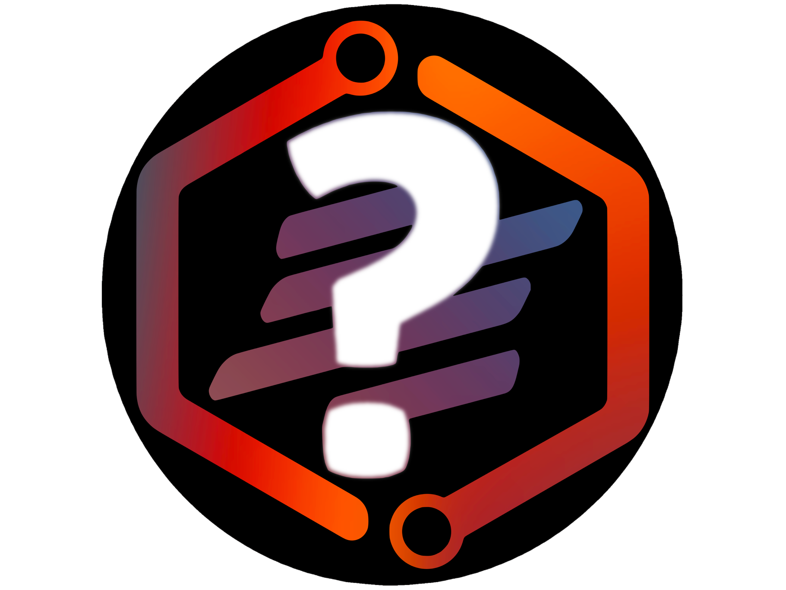

# This bots been dead for a couple weeks now but 
# I am gonna be rewriting this bot from scratch so checkout the rewrite branch
# I have other projects im working on so this rewrite will take a while

[![Contributors][contributors-shield]][contributors-url]
[![Forks][forks-shield]][forks-url]
[![Stargazers][stars-shield]][stars-url]
[![Issues][issues-shield]][issues-url]
[![MIT License][license-shield]][license-url]

 

  

----

  <h1 align="center">Why Bot</h1>

  

    <h3>An open source, multi-purpose discord bot made to enhance your discord experience :)</h3>
    <a href="https://discord.com/api/oauth2/authorize?client_id=896932646846885898&permissions=8&scope=bot%20applications.commands"><strong>[Add to your server]</strong></a>
     
     
    <a href="https://discord.gg/ryEmgnpKND">Discord Server</a>
    ·
    <a href="https://github.com/FusionSid/Why-Bot/issues">Report Bug</a>
  

 

----

?help - For help

----
 

  
Table of Contents

  <ol>
    <li><a href="#about-the-project">About The Project</a></li>
    <li><a href="#built-with">Built With</a></li>
    <li><a href="#contributing">Contributing</a></li>
    <li><a href="#license">License</a></li>
    <li><a href="#contact">Contact</a></li>
    <li><a href="#acknowledgments">Acknowledgments</a></li>
    <li><a href="#commands">Commands</a></li>
  </ol>

 

## About The Project

Why bot is a multipurpose open-source bot.

Why has many features such as:

* Onping messages
* Autoroles / Reactroles and Moderation
* Welcome images
* Fun
* Counting game and Auto calc
* Many Utilities
* Logging
* Tickets
* Music and Custom Vc’s
* Search commands like reddit, google and images
* Image generation
* Leveling System
* and much much more!

Why bot is an open-source project written in Python using Py-Cord. So you can always check the code or contribute to it.
Also why bot will respond to any DM you do to it. So if you want to talk with someone, Why bot will be there.

(<a href="#top">back to top</a>)

## Built With

This project was made using a fork of `discord.py` called `py-cord`.
I did orginaly use `discord.py` for this project but since its no longed being maintained I switched to `py-cord`

### [Pycord Repo](https://github.com/Pycord-Development/pycord)

(<a href="#top">back to top</a>)

## Contributing

Contributions are what make the open source community such an amazing place to learn, inspire, and create. Any contributions you make are **greatly appreciated**.

If you have a suggestion that would make this better, please fork the repo and create a pull request.

Don't forget to give the project a star :)

1. Fork the Project
2. Create your Feature Branch (`git checkout -b newfeature`)
3. Commit your Changes (`git commit -m 'Add some newfeature'`)
4. Push to the Branch (`git push origin newfeature`)
5. Open a Pull Request

(<a href="#top">back to top</a>)

## License

Distributed under the MIT License. See `LICENSE` for more information.

(<a href="#top">back to top</a>)

## Contact

Siddhesh Zantye - [@Fusion_Sid](https://twitter.com/Fusion_Sid) - whybot@fusionsid.xyz

Discord Account: `FusionSid#3645`

Join the Why [Discord Server](https://discord.gg/ryEmgnpKND) For help.

(<a href="#top">back to top</a>)

## Acknowledgments

Even though I take take credit for most of the code, I would like to thank everyone who helped with this bot or any other open source projects which I used code from:

These are the ones I remember:

*  [Knedme's Beat](https://github.com/Knedme/Beat)
*  [Auroris Ticketing Bot](https://github.com/ifisq/discord-ticket-system)
*  [Voice Master - Custom VC](https://github.com/SamSanai/VoiceMaster-Discord-Bot/blob/master/cogs/voice.py)

(<a href="#top">back to top</a>)

[contributors-shield]: https://img.shields.io/github/contributors/FusionSid/Why-Bot.svg?style=for-the-badge
[contributors-url]: https://github.com/FusionSid/Why-Bot/graphs/contributors
[forks-shield]: https://img.shields.io/github/forks/FusionSid/Why-Bot.svg?style=for-the-badge
[forks-url]: https://github.com/FusionSid/Why-Bot/network/members
[stars-shield]: https://img.shields.io/github/stars/FusionSid/Why-Bot.svg?style=for-the-badge
[stars-url]: https://github.com/FusionSid/Why-Bot/stargazers
[issues-shield]: https://img.shields.io/github/issues/FusionSid/Why-Bot.svg?style=for-the-badge
[issues-url]: https://github.com/FusionSid/Why-Bot/issues
[license-shield]: https://img.shields.io/github/license/FusionSid/Why-Bot.svg?style=for-the-badge
[license-url]: https://github.com/FusionSid/Why-Bot/blob/master/LICENSE.txt
[product-screenshot]: images/screenshot.png

---- 

## Commands:

----

|     Name      |     Usage     | Description | 
| ------------- | ------------- | ----------- |
| play | play [name/url] | Play a song
| binarytotext | binarytotext | Convert binary to text
| wh | webhook [id] [text] | Send message through a webhook
| settings | settings | Shows the servers Why Bot settings
| numrn | numrn | Current number for the counting game
| skip | skip | Skips the playing song
| leave | leave | Leave vc
| report | report [message/member/bug] | Report member/message to your server mods and report bugs to me
| rank | rank [@user(optional)] | Shows your rank image
| pause | pause | Pause song
| youtube | youtube [search query] | Searches through youtube for videos
| resume | resume | Resume the paused song
| queue | queue | Show queue
| leaderboard | leaderboard | Shows the leaderboard for your server
| loop | loop | Loop queue/song
| createplaylist | createplaylist [playlist name] | Create a playlist
| currentgames | currentgames | Show current games being played
| info | info [@user] | Returns info on a user
| getuuid | getuuid [ign(optional)] | Returns your minecraft ign
| setign | setign | Sets you minecraft ign
| plugins | plugins [enable/disable] [plugin name] | Enable/Disable Plugins for Why bot
| hystats | hystats [ign(optional)] | Shows a nice pic of your hypixel stats
| plist | plist [playlist name] | Displays all the songs in a playlist
| serverinfo | serverinfo | shows server info
| ping | ping | Shows bot ping
| playlist | playlist [playlist name] | Play a playlist
| botinfo | botinfo | Info about Why bot
| padd | padd [playlist name] [song/songurl] | Add song to a playlist
| bwstats | bwstats [ign(optional) | Shows your bedwars stats
| warnings | warnings [@user] | Displays a users warnings
| createhook | createhook [name] [channel(optional)] | Creates a webhook
| shuffleplaylist | shuffleplaylist [playlist name] | Shuffle a playlist
| goose_mode | goose_mode | This command toggles goose_mode
| pdel | pdel [playlist name] | Delete song from a playlist
| mp3 | mp3 [attach mp3 file] | Play an mp3 file
| tts | tts [text] | Text to speech
| music | music | Small music button dashboard
| claim | claim | Free Coins
| tictactoe | tictactoe | Tic Tac Toe
| hextotext | hextotext [text] | Converts hex to Text
| texttobinary | texttobinary | Convert to binary
| whosplaying | whosplaying [game/activity] | Check whosplaying activity
| setprefix | setprefix [prefix] | Sets the server prefix
| reddit | reddit [subreddit] | Find a random reddit post
| warn | warn [@user] [reason] | Warns a user
| weather | weather [city] | Get weather
| autocalc | autocalc [True/false] | Toggles autocalc for this server
| texttohex | texttohex [text] | Converts Text to hex
| reverse | reverse [text] | Reverses Text
| rock | rock | Rock Image
| dog | dog | Dog Image
| meme | meme | Gets a meme
| cat | cat | Cat Image
| panda | panda | Panda Image
| imagesearch | imagesearch [search query] | Find an image from google
| expand | expand [num] [text] | Expands Text
| fox | fox | Fox Image
| join | join | Bot joins VC
| bird | bird | Bird Image
| tweet | tweet [@person] [message] | Fake tweet image
| ban | ban [@user] | Ban a member
| bug | bug [bug] | Report a bug
| giverole | giverole [@role] [@member] | Give role to a member
| ytcomment | ytcomment [@person] [message] | Fake youtube comment image
| kick | kick [@user] | Kick a member
| apod | apod | Astronomy Picture of the day
| make_vc | make_vc [limit(If none change to None)] [name] | Create a VC
| simp | simp [@member] | Simp card
| lockdown | lockdown [#channel] | Lockdown a channel
| horny | horny [@member] | Horny licence
| unlock | unlock [#channel] | Unlock a channel
| make_channel | make_channel [name] | Create a text channel
| joke | joke | Joke
| overlay | overlay [type] [@member] | Image overlays for you discord profile pic
| avatar | avatar [member] | User avatar
| clear | clear [amount] | Delete messages
| lyrics | lyrics [song name] | Song lyrics command
| nickname | nick [@user] [nickname] | Change a users nick
| wiki | wiki [search] | Wikipedia Search
| newticket | newticket | Creates a ticket
| drunkify | drunkify [text] | Drunkifies Text
| botinvite | botinvite | Invite why to your server
| slowmode | slowmode [seconds] | Set channel to slowmode
| unban | unban [member id] | Unban a banned member
| pin | pin [message id] | Pin a message
| closeticket | closeticket | Close a ticket
| addaccess | addaccess [roleid] | Gives a role access to tickets
| redditimg | redditimg [subreddit] | Find a image from a subreddit
| qrcode | qrcode [url] | Creates a qrcode
| suggest | suggest [suggestion] | Suggest something for Why
| rslowmode | rslowmode | Removes slowmode from a channel
| calculate | calculator | Interactive button calculator
| delaccess | delaccess [roleid] | Removes a role from accessing tickets
| nitro | nitro | Free Coins
| calc | calc [query] | Calculates your query
| addadminrole | addadminrole [roleid] | Adds an admin role for tickets
| unpin | unpin [id] | Unpins a message
| vote | vote | Vote for why bot
| deladminrole | deladminrole [roleid] | Removes an admin role from accessing tickets
| removereactions | removereactions [message id] | Removes reactions from a message
| cuse | cuse [@user(optional)] | How many times have you used Why?
| rps | rps [rock/paper/scissors] | Play a game of rock paper scissors against the bot
| dm | dm [@user] [message] | Bot sends a message on your behalf
| roast | roast | Bot roasts you
| onpinged | onpinged [set/clear(optional)] | Sets your Onpinged message
| sendroast | sendroast [@user] | The bots send a roast to someone on your behalf
| takerole | takerole [@role] [@member] | Remove roles form member
| embed | embed --title test --desc test --channel 123456789 --color blue --timestamp yes --fields 2 | Makes an embed
| 8 ball | 8ball [question] | Asks the 8ball a question
| runcode | runcode [language] [code] | Runs code
| reactrole | reactrole [:emoji:] [@role] [message text] | Creates a reactrole
| invite | invite | Creates a 10 day invite for your discord server.
| say | say [text] | Bot sends text
| yesorno | yesorno [question] | Makes a Yah or Nah poll
| poll | poll [time:seconds] '[title]' [each option followed by a space] | Makes a poll
| autorole | autorole [@role] [all/bot] | Sets the autorole role for the server
| reactemoji | reactemoji [message_id] [word] | React a word to a message
| voice | voice [set/setlimit] | Sets the custom vc for you voice channel
| hack | hack [@user] | Hack someone
| screenshot | screenshot [url] | Screenshot a url
| emojify | emojify [text] | Emojifies Text
